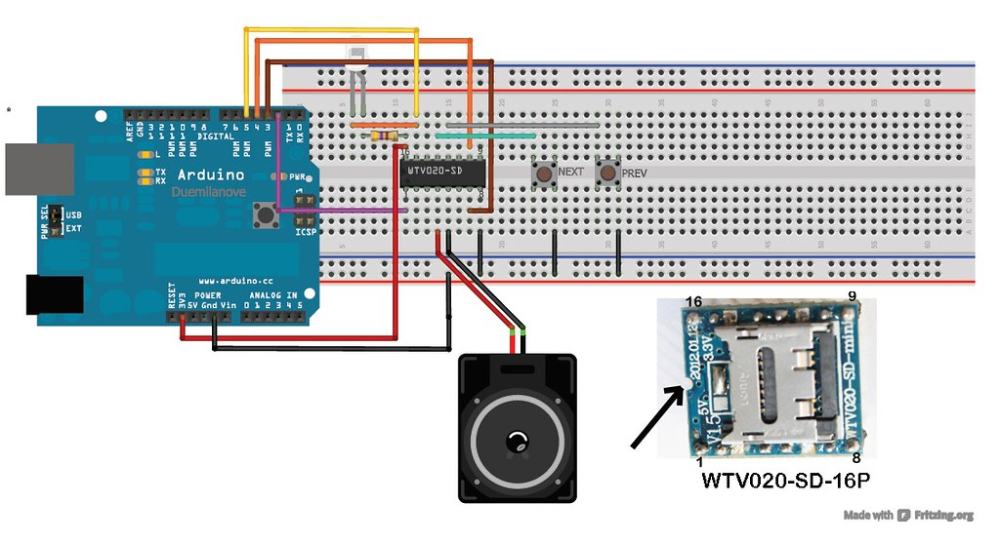
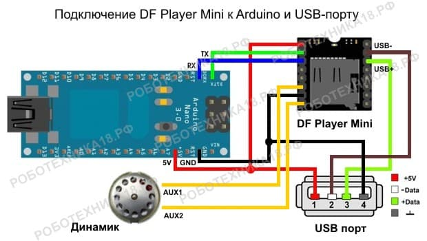
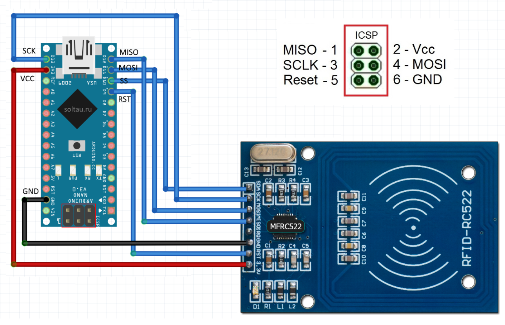
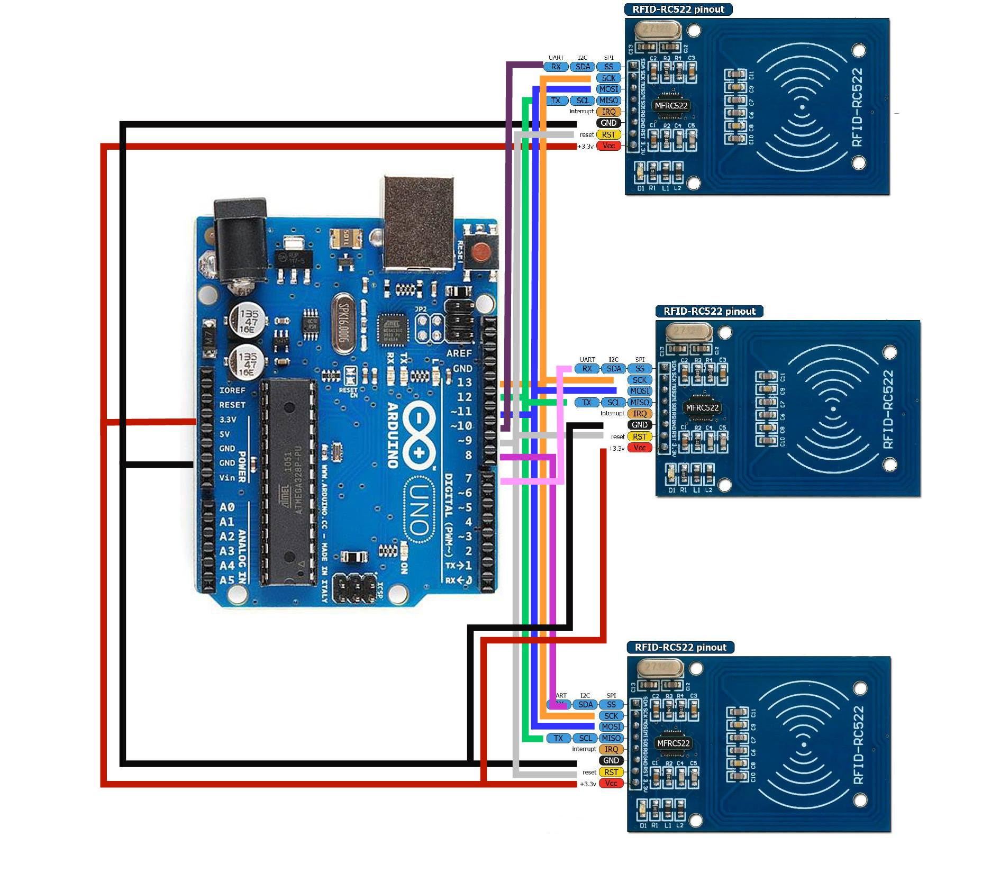

# Test

## Audio

### Cheme audio 1

[Sources audio] (https://www.buildcircuit.com/example-1-using-wtv020sd-16p-music-module-with-arduino/)
### Cheme audio 2

### Amplifier

## RFID
### Get RFID mark
For shit modules use 5v 
[Sources] (https://arduinomaster.ru/datchiki-arduino/podklyuchenie-rfid-k-arduino/)

[Multi RFID] (https://github.com/Annaane/MultiRfid)

